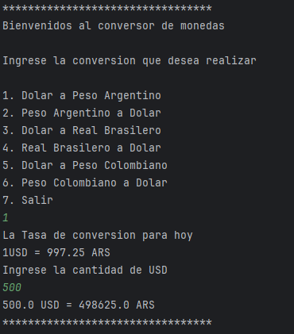
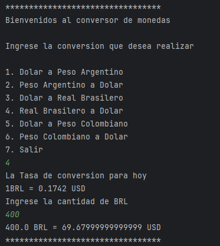
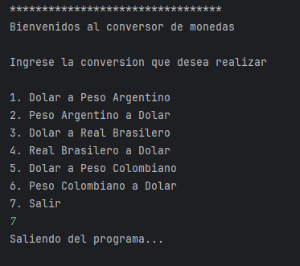
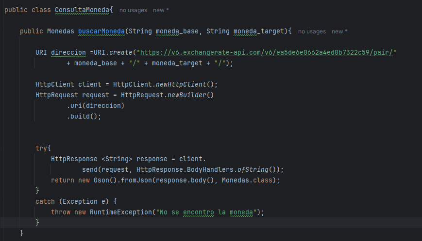
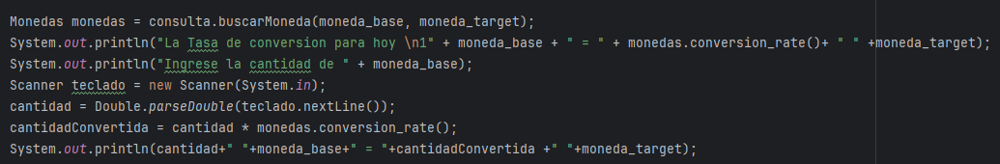
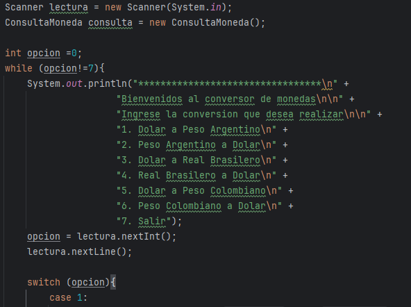

<h1> # CONVERSOR DE MONEDAS </h1>

<h2 align="center"> Descripcion del proyecto 🤓: </h2>

 Este es un proyecto en el cual aprendemos y hacemos uso de la biblioteca de GSON para poder manejar y utilizar los datos proporcionados 
por la API https://www.exchangerate-api.com/, este proyecto realiza la conversion de una moneda a otra ambas elegidas por el usuario entre 6 opciones disponibles.

<h3 align="center"> Usos del proyecto ☑️:</h3>

 Se le pide al usuario un numero para seleccionar que conversion desea realizar, luego se le pide los valores de las divisas
y se procede a realizar y devolver la conversion

 Se muestra como se realiza la conversion de 500 💵:USD (Dolares) a 💵ARS (Pesos Argentinos)

 Se muestra como se realiza la conversion de 400 💵BRL (Reales) a 💵USD (Dolares)

❗ Se realiza la muestra de la salida del programa ❗:

<h4 align="center"> 💼 Muestra de Clases del Proyecto 💼 </h4>

 Clase consulta: Se recibe la API y se realizan las verificaciones para poder devolver los datos en formato GSON correctamente 

 Clase conversion: Se reciben los datos en formato GSON ya validados y se procede a pedirle el monto a convertir 

 Clase main: Realiza el envio y rececpcion de los datos, para luego mostrarlos por consola 

<h5 align="center"> Tecnologias utilizadas ⌨️: </h5>

<h6 align="center"> Realizado por Lautaro Fernandez Esposito </h6>

